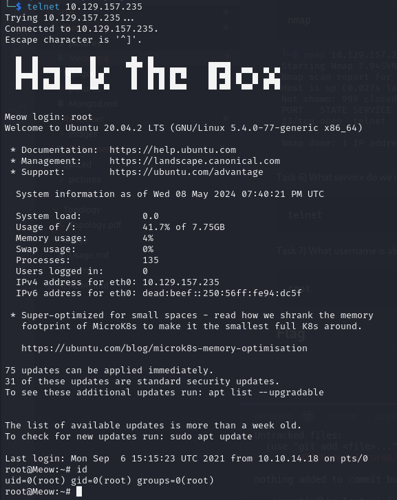
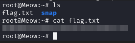

# Meow

## Answers to questions

Task 1) What does the acronym VM stand for?

```text
virtual machine
```
Task 2) What tool do we use to interact with the operating system in order to issue commands via the command line, such as the one to start our VPN connection? It's also known as a console or shell.

```text
terminal
```

Task 3) What service do we use to form our VPN connection into HTB labs?

```text
openvpn
```

Task 4) What tool do we use to test our connection to the target with an ICMP echo request?

```text
ping
```

Task 5) What is the name of the most common tool for finding open ports on a target?

```text
nmap
```


Task 6) What service do we identify on port 23/tcp during our scans?

```text
telnet
```

Task 7) What username is able to log into the target over telnet with a blank password?

```text
root
```





## Flag


