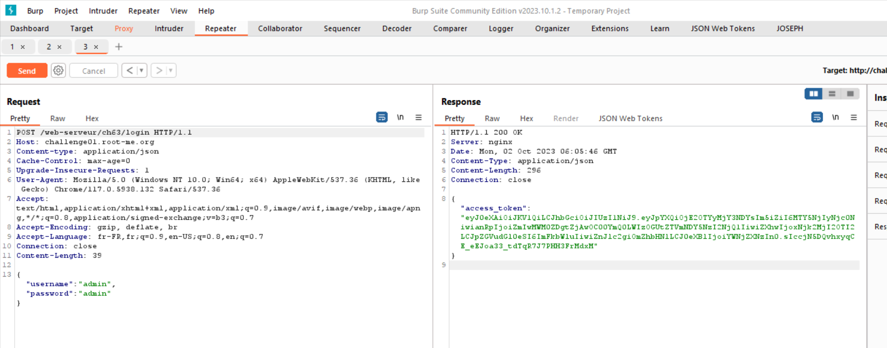
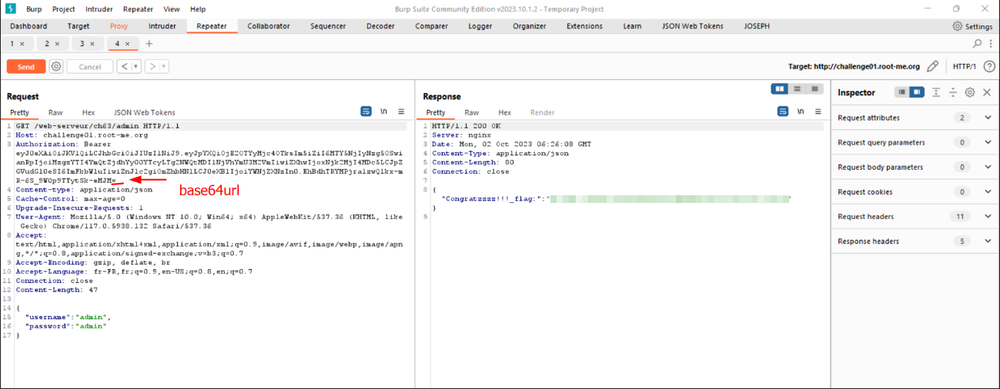

# Exploit

POST /login with username and password

We have a token. The problem is that this token cannot be used in the state, because its signature has expired.
According to the source code in the challenge description, each time a user is added, their signature is added to a blacklist (not very practical XD).

Therefore, for our admin user to be able to authenticate, we must bypass the blacklist by re-encoding our signature in "base64url". In fact, a simple "=" at the end of the signature is enough.
https://stackoverflow.com/questions/55389211/string-based-data-encoding-base64-vs-base64url

# Flag

