# Traverse

## Information Gathering

### Enumerate Applications on Webserver


```text
ffuf -w /usr/share/wordlists/SecLists/Discovery/Web-Content/directory-list-2.3-medium.txt -u http://traverse.thm/FUZZ -c -v
```

```text
HTTP 301 status : 
http://traverse.thm/client/
http://traverse.thm/api/
http://traverse.thm/javascript/
http://traverse.thm/img/
http://traverse.thm/logs/
http://traverse.thm/planning/
http://traverse.thm/phpmyadmin/

HTTP 403 status :
http://traverse.thm/server-status
```

### Fingerprint Web Server

Service on 80/tcp : 


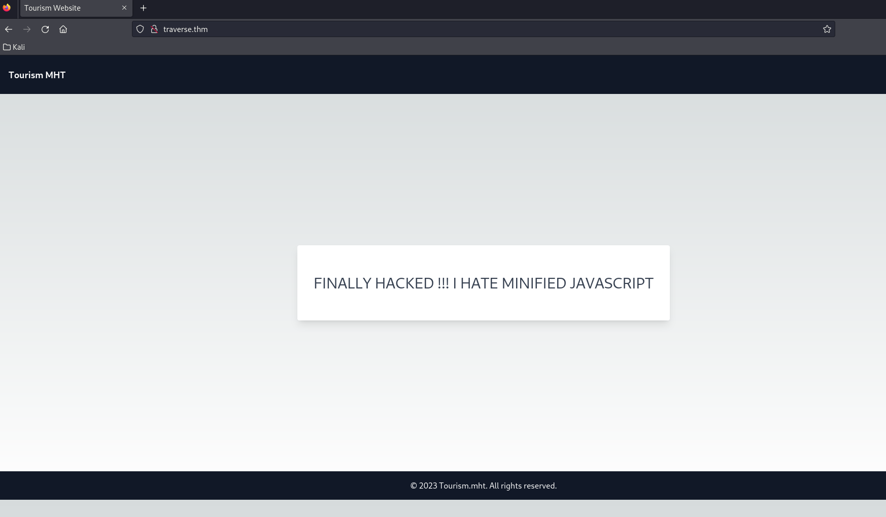


GET request with BurpSuite and web server response :


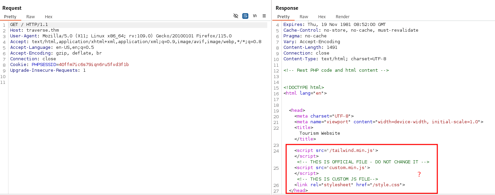


With the above query, we discovered new paths in the :

```text
http://traverse.thm/tailwind.min.js
http://traverse.thm/custom.min.js
http://traverse.thm/style.css
```

In particulary "/custom.min.js" :

```text
28 66 75 6E 63 74 69 6F 6E 28 29 7B 66 75 6E 63 74 69 6F 6E 20 64 6F 4E 6F 74 68 69 6E 67 28 29 7B 7D 76 61 72 20 6E 3D 22 44 49 52 45 43 54 4F 52 59 22 3B 76 61 72 20 65 3D 22 4C 49 53 54 49 4E 47 22 3B 76 61 72 20 6F 3D 22 49 53 20 54 48 45 22 3B 76 61 72 20 69 3D 22 4F 4E 4C 59 20 57 41 59 22 3B 76 61 72 20 66 3D 6E 75 6C 6C 3B 76 61 72 20 6C 3D 66 61 6C 73 65 3B 76 61 72 20 64 3B 69 66 28 66 3D 3D 3D 6E 75 6C 6C 29 7B 63 6F 6E 73 6F 6C 65 2E 6C 6F 67 28 22 46 6C 61 67 3A 22 2B 6E 2B 22 20 22 2B 65 2B 22 20 22 2B 6F 2B 22 20 22 2B 69 29 3B 64 3D 75 6E 64 65 66 69 6E 65 64 7D 65 6C 73 65 20 69 66 28 74 79 70 65 6F 66 20 66 3D 3D 3D 22 75 6E 64 65 66 69 6E 65 64 22 29 7B 64 3D 75 6E 64 65 66 69 6E 65 64 7D 65 6C 73 65 7B 69 66 28 6C 29 7B 64 3D 75 6E 64 65 66 69 6E 65 64 7D 65 6C 73 65 7B 28 66 75 6E 63 74 69 6F 6E 28 29 7B 69 66 28 64 29 7B 66 6F 72 28 76 61 72 20 6E 3D 30 3B 6E 3C 31 30 3B 6E 2B 2B 29 7B 63 6F 6E 73 6F 6C 65 2E 6C 6F 67 28 22 54 68 69 73 20 63 6F 64 65 20 64 6F 65 73 20 6E 6F 74 68 69 6E 67 2E 22 29 7D 64 6F 4E 6F 74 68 69 6E 67 28 29 7D 65 6C 73 65 7B 64 6F 4E 6F 74 68 69 6E 67 28 29 7D 7D 29 28 29 7D 7D 7D 29 28 29 3B
```

## Deobfuscated javascript file

After several attempts with CyberChef :


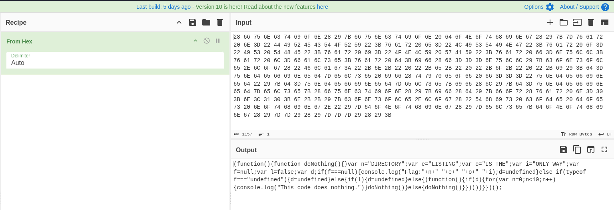

So we have the answer to the first and second question : 


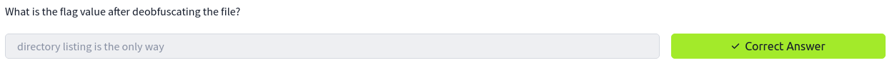


## Review Old Backup and Unreferenced Files for Sensitive Information

With our information gathering above, we managed to discover the path “/logs/email_dump.txt”, here's the result :


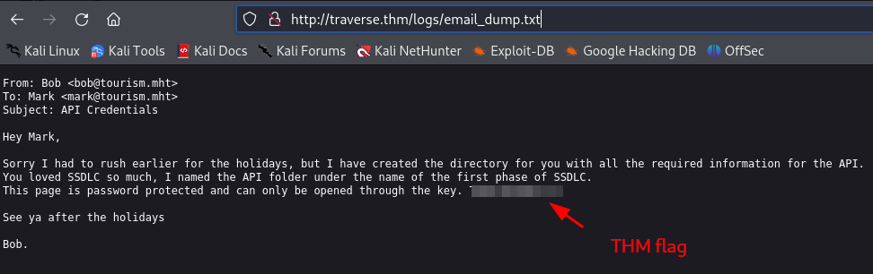


So we have the answer to the third question : 


Then, to answer the fourth question, you had to have passed the TryHackMe SSDLC room [here](https://tryhackme.com/r/room/securesdlc)


The flag above will be used to answer the fifth question :


## Testing for Bypassing Authorization Schema

Then, to answer the sixth question, we need to dig a little deeper and understand how to use this API, we have our answer with the path “/planning” (you need to enter the flag from question 5 as the password) : 


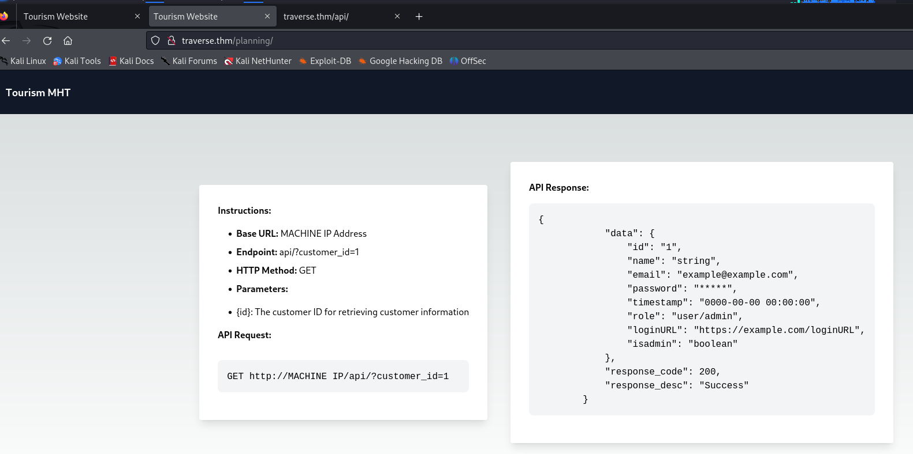

So, if we use this API with ID 5 and BurpSuite Repeater :


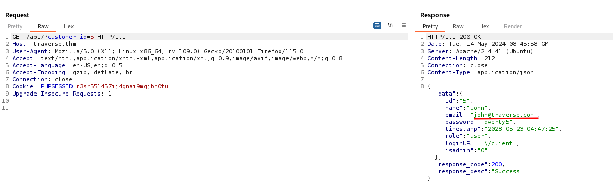


Answer to the sixth question : 


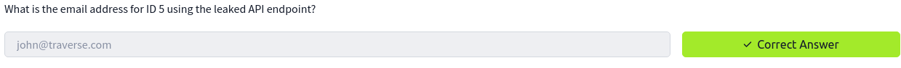


## Vertical Privilege Escalation

To continue, we need to guess the admin account ID, here are the results with BurpSuite Intruder (simple payload from 0 to 9): 


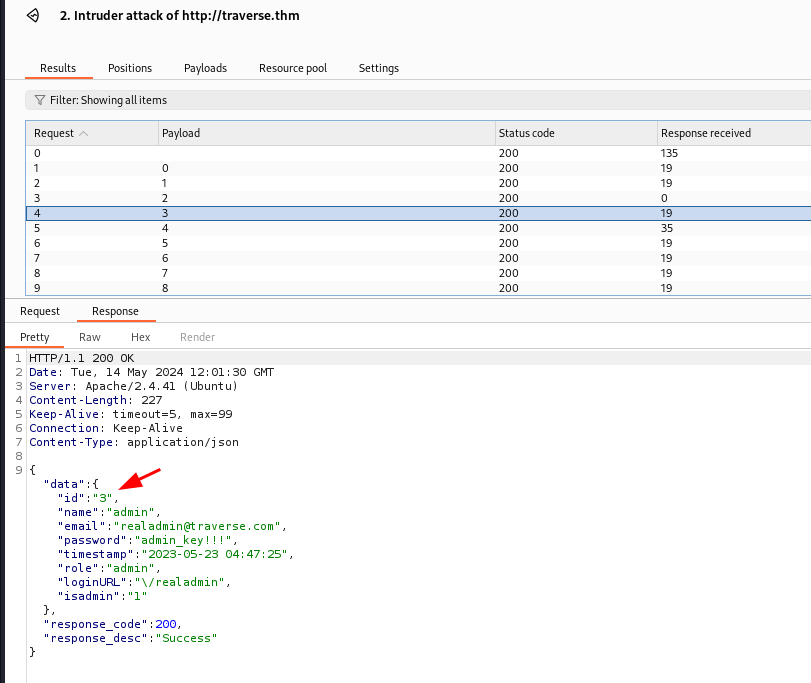


So, answer to the seventh and eighth questions : 


Now let's connect to the administrator interface (to "/realadmin" path) : 


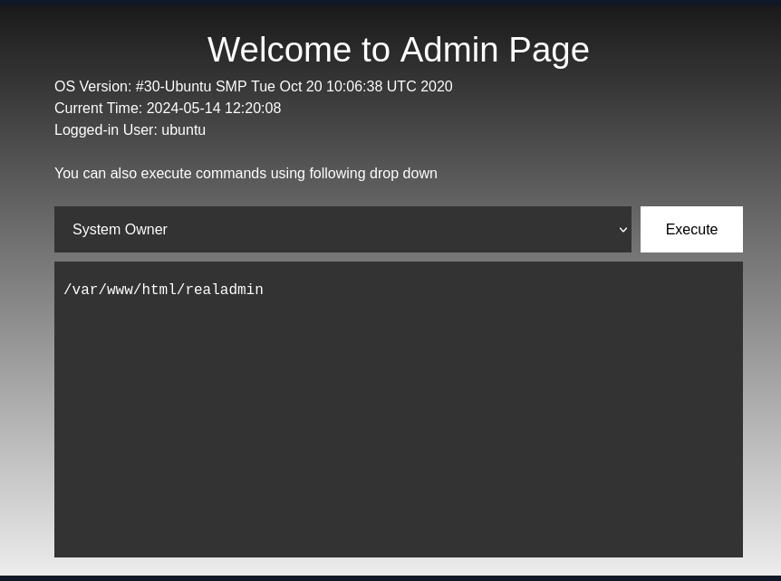


## Input Validation Testing

With this interface, we have a good chance of having an command injection vulnerability.

Here's a behind-the-scenes look at the “System Owner” query via BurpSuite repeater : 


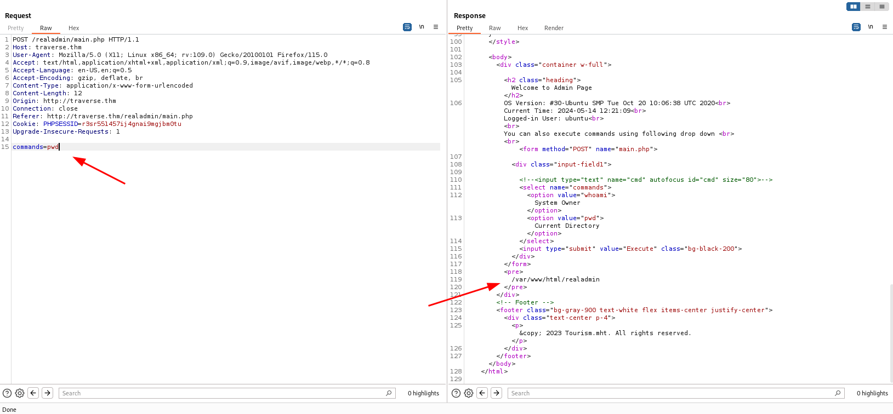


We will therefore modify the “pwd” command with “ls” to list the files in the current directory : 


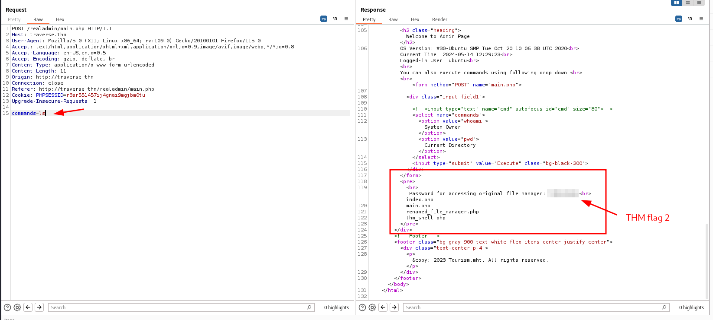


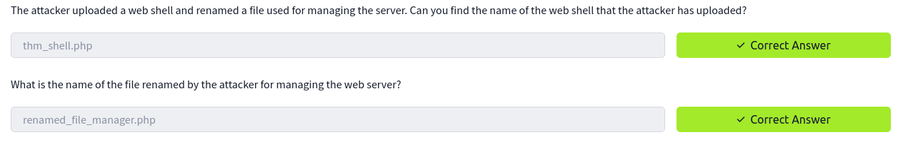


Now the aim is to restore the site to its initial state. To do this, we need to find the site's main file.

Go back with the “ls ../” command : 


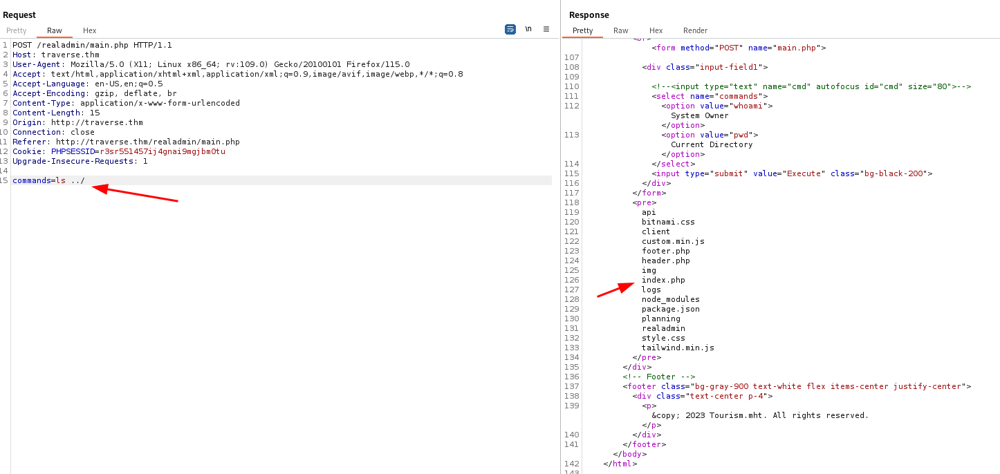


And if we read the “index.php” file, we see the message left by the hacker : 


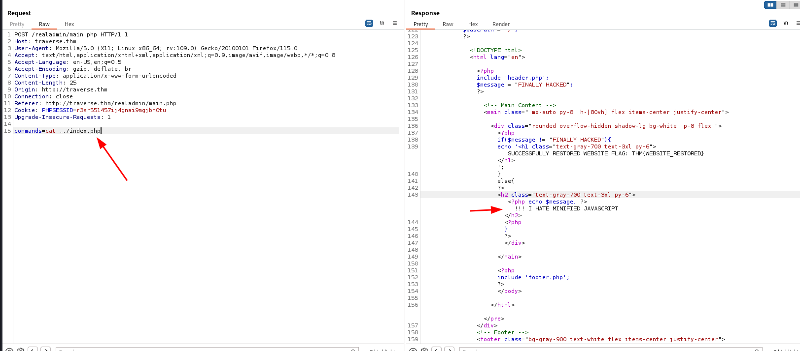


## Gain Access with reverse shell

Now, with a shell command, we'll try to upload a reverse shell payload :

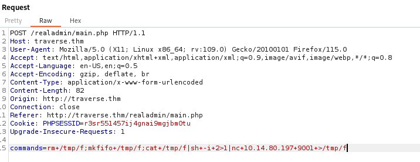


And execute a listener : 


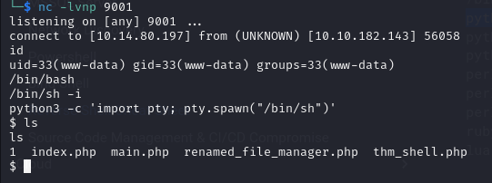


## Restore website

We can now remove the undesirable line from the index.php file for restore website.


And finaly, take flag after restore :


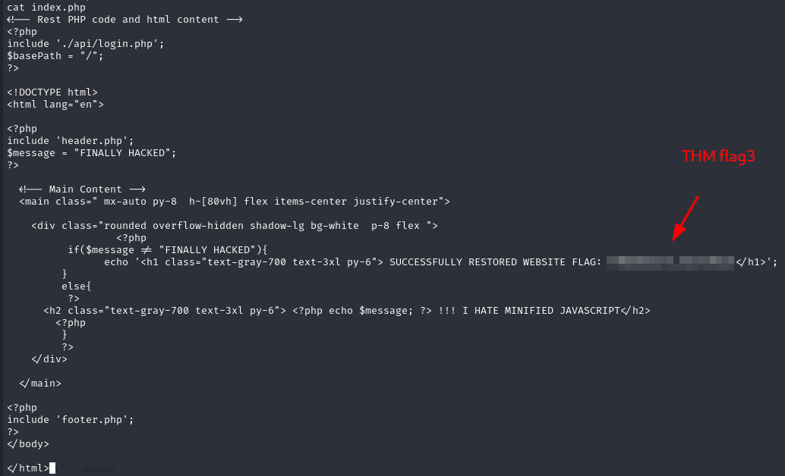


